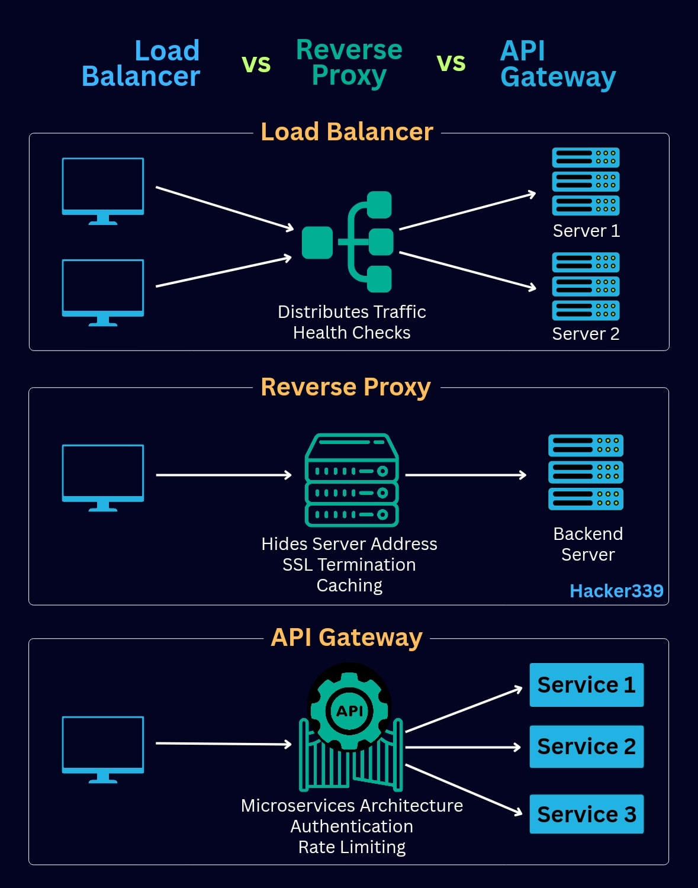

## API gateway vs Load balancer vs Reverse proxy

+ [Load Balancer vs. Reverse Proxy vs. API Gateway: Demystifying Web Architectures](https://www.designgurus.io/blog/load-balancer-reverse-proxy-api-gateway)
+ [Load Balancer vs Reverse Proxy vs API Gateway](https://medium.com/codenx/load-balancer-vs-reverse-proxy-vs-api-gateway-fcb79912abbf)
+ [Load Balancer vs Reverse Proxy vs API Gateway](https://blog.algomaster.io/p/load-balancer-vs-reverse-proxy-vs-api-gateway)
+ [API Gateway vs Reverse Proxy vs Load Balancer: Understanding the Differences](https://api7.ai/learning-center/api-gateway-guide/api-gateway-vs-reverse-proxy-vs-load-balancer)

### Reverse Proxy:

+ Function: A reverse proxy sits in front of one or more web servers, intercepting client requests and forwarding them to the appropriate backend server. It acts as an intermediary, hiding the backend server's identity and providing a single public-facing endpoint.
+ Key Features: Security (hiding internal network details), caching static content, SSL termination, URL rewriting.
+ Analogy: A receptionist who directs visitors to the correct department within an office, without the visitors needing to know the internal layout.

### Load Balancer:

+ Function: A load balancer distributes incoming network traffic across multiple servers in a server farm. Its primary goal is to ensure high availability, scalability, and optimal resource utilization.
+ Key Features: Traffic distribution algorithms (e.g., round robin, least connections), health checks to remove unhealthy servers, session persistence.
+ Analogy: A traffic controller directing cars to different lanes on a highway to prevent congestion and ensure smooth flow.

### API Gateway:

+ Function: An API gateway acts as a single entry point for all API requests to a backend system, especially common in microservices architectures. It handles various cross-cutting concerns before routing requests to specific backend services.
+ Key Features: Request routing, authentication and authorization, rate limiting, logging and monitoring, request/response transformation, protocol translation.
+ Analogy: A concierge at a hotel who manages all guest requests, handles various services (reservations, room service), and directs guests to the appropriate facilities.

### Relationship and Overlap:

+ A reverse proxy can provide basic load balancing functionality, but a dedicated load balancer offers more sophisticated algorithms and features for traffic distribution.
+ An API gateway often incorporates reverse proxy and load balancing capabilities as part of its broader functionality. It sits at a higher level, focusing on API-specific concerns and service orchestration.
+ It is common to see these components layered, with a reverse proxy or load balancer handling initial traffic, and an API gateway managing API-specific interactions with backend services.
